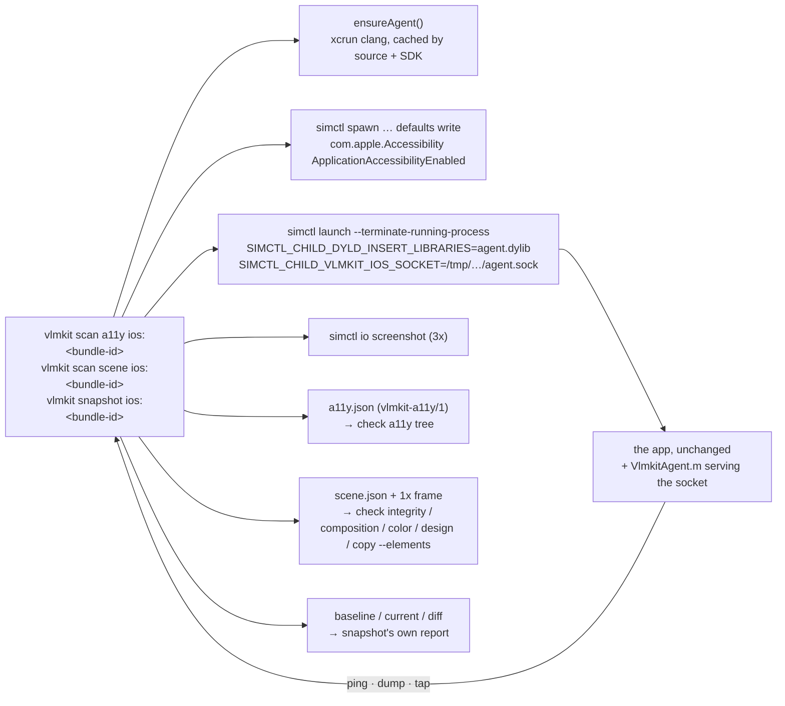

# iOS Simulator: `scan a11y ios:` · `scan scene ios:` · `snapshot ios:`

vlmkit judges an iOS app running in the Simulator with **no code of vlmkit's in the app**: no
SDK, no test target, no entitlement, no Xcode project of vlmkit's. The app is relaunched with
a small agent dylib injected through the environment, the agent answers over a unix socket,
and the host turns its answers into the two contracts the judges already read.



```bash
# The fixture app: built with one swiftc call, installed on the booted simulator
examples/ios-sample/build.sh

vlmkit scan a11y ios:dev.vlmkit.sample --out a11y.json          # + a11y.png at the screen scale
vlmkit check a11y tree a11y.json                                  # unlabelled-control / unreachable-content / contrast-below-aa / target-undersized

vlmkit scan scene ios:dev.vlmkit.sample --out scene.json         # + scene.png at 1x (and scene@3x.png)
vlmkit check integrity   --elements scene.json --image scene.png
vlmkit check composition --elements scene.json --viewport 402
vlmkit check color       --elements scene.json
vlmkit check design      --elements scene.json

vlmkit scan a11y ios:dev.vlmkit.sample --tap "Open profile" --tap "Dark mode" --out profile.json   # reach a screen first
vlmkit snapshot ios:dev.vlmkit.sample --output snapshots/         # first run writes the baseline, the next compares

vlmkit scan a11y ios:dev.vlmkit.sample --dump dump.json           # keep the raw dump …
vlmkit scan a11y dump.json --frame a11y.png --out a11y.json       # … and convert it again with no simulator
vlmkit scan scene dump.json --frame a11y.png --out scene.json
```

The whole round — agent build from cache, relaunch, settle, dump, screenshot — takes about
five seconds on an iPhone 17 / iOS 27.0 simulator; the first agent build adds one.

## How the agent gets in, and why not LLDB

`simctl launch` copies every `SIMCTL_CHILD_*` variable into the app's environment, and a
simulator process honours `DYLD_INSERT_LIBRARIES` — measured 2026-09-27 on iOS 27.0, the
agent loads into Apple's own Messages app. So the requirement "no special code in the app"
holds for any installed app, not only the project's debug build.

LLDB was the other candidate. `lldb -p <pid>` on a simulator process without
`get-task-allow` is refused ("Not allowed to attach to process"), which rules out every
app that is not the project's own debug build, and attaching to one that is takes seconds and
fights Xcode for the process. Injection covers the wider set and costs nothing per request.

The agent (`packages/vlmkit-markup/ios-agent/VlmkitAgent.m`, one Objective-C file) is
**built on the user's machine** by `xcrun --sdk iphonesimulator clang` on first use and cached
under `~/Library/Caches/vlmkit/ios-agent/<hash>/`, keyed by its source, the SDK path and the
architectures. A dylib for the simulator has to match the host's architecture and is useless
without Xcode, and Xcode is what makes the build a one-second call; shipping a binary would
add a signing and architecture problem and remove the ability to read what runs in the app.
`VLMKIT_IOS_AGENT=/path/to.dylib` uses a prebuilt one.

It serves one JSON line per connection on the socket named by `VLMKIT_IOS_SOCKET` — the
simulator shares the host's filesystem, so the host connects to the same `/tmp` path
(`sun_path` holds 104 bytes; the path is kept short on purpose):

| request | answer |
|---|---|
| `{"cmd":"ping"}` | pid, process, bundle id, screen (points, scale) |
| `{"cmd":"dump"}` | `vlmkit-ios-dump/1`: every window's view hierarchy — frames in screen points, colours as `rgba()`, fonts, texts with their measured extents, scroll geometry — each with its UIAccessibility answers, plus the elements a view announces that are not views (SwiftUI's nodes) |
| `{"cmd":"tap","x":…,"y":…}` | a synthesized touch at that screen point, through hit-testing and the responder chain |
| `{"cmd":"methods","cls":…,"match":…}` | the selectors a class really has — for the next iOS |

Everything that touches UIKit runs on the main thread. **The agent reports; it never judges.**
Roles, operability, contrast and every verdict are the host's
(`packages/vlmkit-markup/src/ios/dump.ts`).

## Accessibility is off in a process nobody is inspecting

The first dump of the fixture had **one** accessibility element out of twenty-two: the custom
control that set its own label. UIKit loads its accessibility bundle only when the device
says an assistive client exists; without it every `UILabel` answers
`isAccessibilityElement == NO` and `accessibilityLabel == nil`, and `UIButton` has no name.

The switch is one device default, read at app launch:

```bash
xcrun simctl spawn booted defaults write com.apple.Accessibility ApplicationAccessibilityEnabled -bool true
```

Measured on iOS 27.0: this key alone is enough (`AccessibilityEnabled` and
`AutomationEnabled` are not needed). `scan` sets it when it is not set, says so in its
output, and leaves it set — it persists on the device and changes nothing a user sees.

With it on, the dump carries what VoiceOver would announce, including three things worth
knowing before reading a report:

- **SF Symbols name themselves.** A button whose only content is `UIImage(systemName:
  "gearshape")` announces "Gear shape", and one with `"trash"` announces "Trash". The fixture's
  unlabelled buttons draw their glyph, because a symbol is never unlabelled.
- **A view that sets `accessibilityElements` announces those and nothing else under it.** A
  SwiftUI hosting view lists its nodes and the UIKit views it hosts (a text field, a switch);
  the agent dumps that list first, and the host does not descend into the remaining subviews
  for the tree — otherwise the `UISwitch` under a SwiftUI `Toggle` read as a second, nameless
  switch.
- **A SwiftUI node's frame is its content.** "Tiny", a 20x20 button, announces a 17x12 frame
  (its text), and a `Toggle` announces its whole row while its activation point is the switch.

## Taps are synthesized touches, at the platform's activation point

`--tap <name>` finds the announced node with that exact name, takes its
`accessibilityActivationPoint` when that lies inside its frame (else the frame's centre), and
asks the agent to touch there. The agent builds a `UITouch` with UIKit's private setters,
attaches an `IOHIDEvent` (the KIF technique — since iOS 9 gesture recognizers read the HID
event, not only the touch), and sends began and ended through `UIApplication.sendEvent:`, so
the touch is hit-tested and delivered like a finger's. Measured on iOS 27.0:

- a `UIButton`'s target-action fires (the fixture's status label changes);
- a push through `UINavigationController` happens (the SwiftUI screen appears);
- a SwiftUI `Toggle` flips when the touch lands on its switch — and does not when it lands on
  the row's centre, which is the label, exactly as a finger would not. This is why the
  activation point is used: the row is what the node announces, the switch is where it acts.

Every private selector this needs exists on iOS 27.0
(`_setLocationInWindow:resetPrevious:`, `setPhase:`, `_touchesEvent`,
`_addTouch:forDelayedDelivery:`, `_setHIDEvent:`); the agent checks each before the first tap
and names the missing one if an iOS removes it. The `methods` request is there to find its
replacement. `accessibilityActivate` would have needed none of this, but it bypasses
hit-testing — a control covered by another view would still "work".

A tap is followed by the same settling wait as the launch: dumps 150ms apart until two
serialize identically. No fixed sleeps.

## What each contract gets

**`vlmkit-a11y/1`** (`iosDumpToA11yTree`): the announced elements, the scroll views that
make content reachable, and the windows. Roles come from traits first — `header` → heading,
`button`, `link`, `adjustable` → slider, `toggleButton` / `UISwitch` → switch, `searchField`
or a text-field class → textfield — then the class. A text field's name is its label or its
placeholder, as the Android importer reads `hint`. Only an announced element gets `tap`: a
window or a scroll view answers `accessibilityRespondsToUserInteraction` too, and giving it
`tap` once made it the operable ancestor of every small button, so nothing was ever
undersized. Units are points; `scale` carries the screen scale so contrast is measured on the
3x frame.

**Scene** (`iosDumpToScene`): the painted views, in points, with text, measured text extents,
colours, fonts, corner radius, border and opacity; the screenshot boxed down to 1x beside it,
because the `--elements` gates read the image at 1:1. Three rules keep UIKit's insides out:

- a UIKit control is a leaf (a `UISwitch` holds a 630pt-wide image view that read as a
  protrusion; a `UITextField`'s text layout views are not content), and a `UIButton`'s text is
  lifted from its title label so the button is one element with one text;
- private chrome (`_UIBarBackground`, `_UITouchPassthroughView`, scroll indicators) is not
  recorded — a bar background that extends under the status bar read as a 62pt protrusion —
  but its subtree is still walked, because a navigation title lives under
  `_UINavigationBarHostedViewContainer`;
- a `.roundedRect` / `.bezel` / `.line` text field gets `outline: true`: UIKit paints its
  edge in a subview this walk does not record, and `check color`'s
  `control-boundary-invisible` should not fire on a boundary that is there.

A `UILabel` whose measured text is wider than its box gets `clip` = its box, so
`text-clipped` reports the truncation; a `numberOfLines: 1` label is measured single-line.

## What the fixture plants, and what is found

`examples/ios-sample/` is a UIKit screen and a SwiftUI screen, built by `build.sh` with one
`swiftc` call (no Xcode project — the build is the file). Every defect is on purpose, and
`packages/vlmkit-markup/src/ios/ios.test.ts` asserts each one against the saved dumps in
`fixtures/ios-sample/` with no simulator:

| planted | found by |
|---|---|
| a text field with no placeholder and no label | `unlabelled-control` (textfield) |
| a button whose only content is a drawn image | `unlabelled-control` (button), on both screens |
| "Seed hint" in `#BBBBBB` on white | `contrast-below-aa` 1.91:1 — and `low-contrast-text` on the scene |
| "log 1"…"log 5" at y=1100 in a plain view | `unreachable-content`, 5 nodes past the bottom edge |
| "Info" 20x20 touching a 44pt button | `target-undersized` |
| "Help" 20x20 with 4pt before it and room after | excused by 2.5.8's spacing exception |
| "Place here" 17pt inside a 44pt operable row | enclosed by the row, judged as it |
| "Next" disabled | judged, listed as exempt for contrast |
| a single-line label given 200pt for a much longer sentence | `text-clipped`, 348px |
| "Tiny" 20x20 touching "Save" (SwiftUI) | `target-undersized` |

Regenerate the dumps after changing the app (the test header has the three commands).

## Environment, measured

- Xcode 27.1 beta on macOS 27: `Simulator.app` is gone, `DeviceHub.app` boots devices
  (`open -a …/Contents/Applications/DeviceHub.app --args -CurrentDeviceUDID <udid>`). A
  headless `xcrun simctl boot` of an iOS 26.5 device never reached SpringBoard in ten minutes;
  iOS 27.0 through DeviceHub booted in under a minute. `resolveDevice` therefore refuses to
  boot on its own and prints the command.
- The simulator's screenshot is at the screen scale (1206x2622 for 402x874 points at 3x).
- Nothing here runs in CI: the tests read the saved dumps and frames. A macOS runner with
  an Xcode whose simulator boots headless would run `build.sh` and the three scans; that
  matrix was not measured.

## Not done, on purpose or not yet

- **Flutter iOS and React Native** were not measured. Flutter's `FlutterSemanticsObject`s and
  React Native's UIKit views should read through the same walk; a fixture for each is the
  next round.
- **Physical devices**: `DYLD_INSERT_LIBRARIES` is not honoured there and `simctl` does not
  reach them. The XCUITest hierarchy is the platform's answer on a device, and needs a test
  target.
- **Text entry** (`setText`) and scrolling are not driven; `--tap` is the only step.
- **`snapshot ios:`** has no `--tap`: a state to snapshot is reached with the app's own launch
  arguments, or judged from `scan a11y --tap`'s frame.
